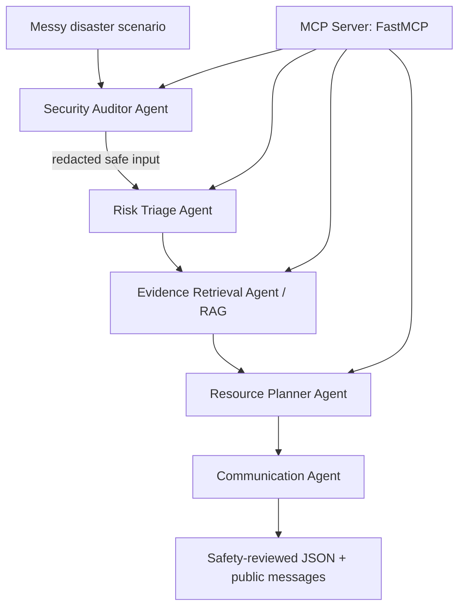

# Architecture

## Workflow

1. Audit input for PII and prompt injection.
2. Detect hazard and urgency.
3. Retrieve relevant guideline snippets.
4. Estimate resource gaps and priority actions.
5. Generate privacy-preserving messages.
6. Save structured output for evaluation.
